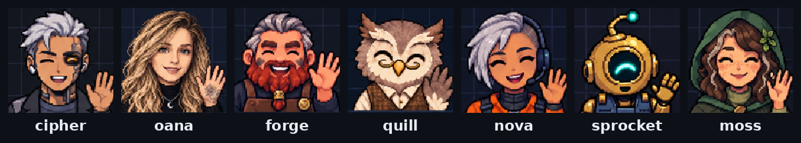

# claude-agent-portraits

[](LICENSE)

An animated pixel-art portrait above your Claude Code prompt. It waves hello, thinks, talks while Claude answers, reads, types, runs commands, winces when a tool fails and falls asleep when you walk away.



This is the Claude Code version of [pi-agent-portrait](https://github.com/testy-cool/pi-agent-portrait), built as a Claude Code mod (a plugin of function hooks). The characters and the drawing script are the same, so a set drawn for one works in the other.

## Install

```bash
claude plugin marketplace add testy-cool/claude-agent-portraits
claude plugin install agent-portrait@claude-agent-portraits
```

Start Claude Code and `oana` appears above the prompt. The picture needs a terminal with the kitty graphics protocol, such as Ghostty or kitty. Other terminals show a one-line description of the state instead.

Inside a multiplexer, Claude Code cannot ask the terminal whether it shows images, so it shows the text instead. herdr passes the images through, so you can force them on. Add this line to your shell profile, then restart Claude Code:

```bash
[[ -n $HERDR_ENV && $TERM_PROGRAM == ghostty ]] && export CLAUDE_CODE_FORCE_TERMINAL_IMAGES=1
```

## Switch characters

```text
/portrait          list the sets
/portrait nova     switch to nova for this project
```

The choice is saved in `.claude/agent-portrait/config.json`, so each project can have its own face. Bundled sets: `oana`, `nova`, `cipher`, `forge`, `moss`, `quill`, `sprocket`, `default` and `red`.

To change the default set or the height, open `/config` and look for the `agent-portrait` rows.

## Draw your own

Ask Claude for one. The plugin ships a `draw-portrait` skill, so a request like this is enough:

```text
draw a portrait for this project: a deploy agent, a grizzled dwarf blacksmith with a braided red beard
```

Claude runs the drawing script, shows you the sheet, and you switch to it with `/portrait forge`. You can also hand it a photo, or ask for a second take of a set you already have.

To run the script yourself, from the project folder:

```bash
scripts/draw-portrait --name forge --role "a deploy agent" \
  --direction "a grizzled dwarf blacksmith with a braided red beard"
```

An image model draws all 30 frames on one sheet, the script cuts them up and writes the set to `.claude/agent-portrait/emotes/forge/`, then selects it for that project. Pass `--photo me.png` to draw a character that looks like someone, or `--variant 2` to add a second take of every frame.

It needs Python 3 with Pillow and NumPy, plus one image model:

- **Codex CLI** (`--backend codex`, picked when `codex` is installed): its built-in image tool, on your ChatGPT login.
- **Azure OpenAI** (`--backend azure`): set `AZURE_IMAGE_ENDPOINT` to the full `.../openai/v1/images/edits` URL, plus `AZURE_IMAGE_KEY` and `AZURE_IMAGE_MODEL`.

## What it reacts to

| State | When |
|-------|------|
| hi | Session start, or a new set |
| heard, then think | You send a prompt |
| talk | Claude is writing its answer |
| read | Read |
| write | Write, Edit, NotebookEdit |
| bash | Bash |
| search | Grep, Glob, WebSearch, WebFetch and tools named like them |
| tool | Any other tool |
| error | A tool returned an error |
| success | The turn finished |
| interrupted | You pressed Esc |
| failure | The turn ended in an API error or a refusal |
| compact | The conversation is being compacted |
| sleep | Five idle minutes |

A set that has no frames for a state shows the closest one it has.

## Where sets are found

The first folder that has the set wins:

1. `<project>/.claude/agent-portrait/emotes/<set>`
2. `<project>/.pi/extensions/pi-emote/emotes/<set>`, so a project set up for pi keeps its face
3. `~/.claude/agent-portrait/emotes/<set>`
4. the sets bundled with the plugin

## Credits

Based on [pi-emote](https://github.com/cgxeiji/pi-emote) by [@cgxeiji](https://github.com/cgxeiji), who made the original state machine and the `default` and `red` sets.
